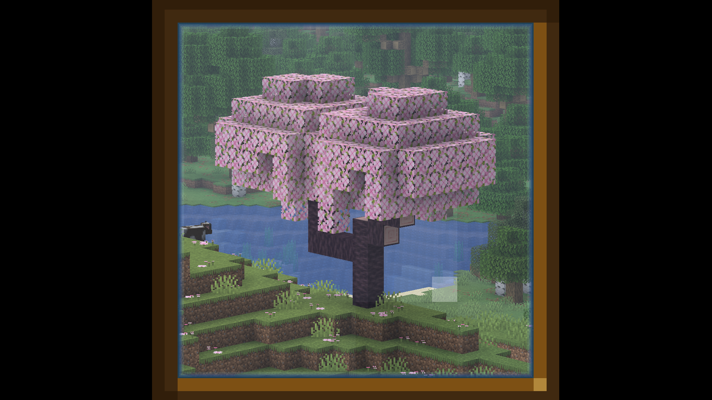
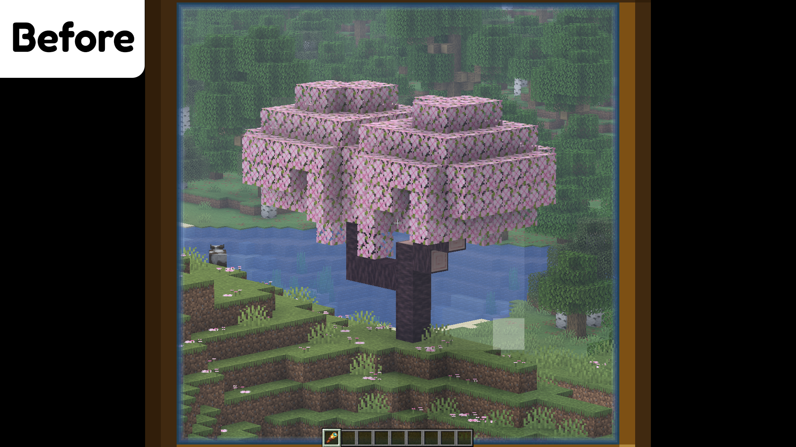
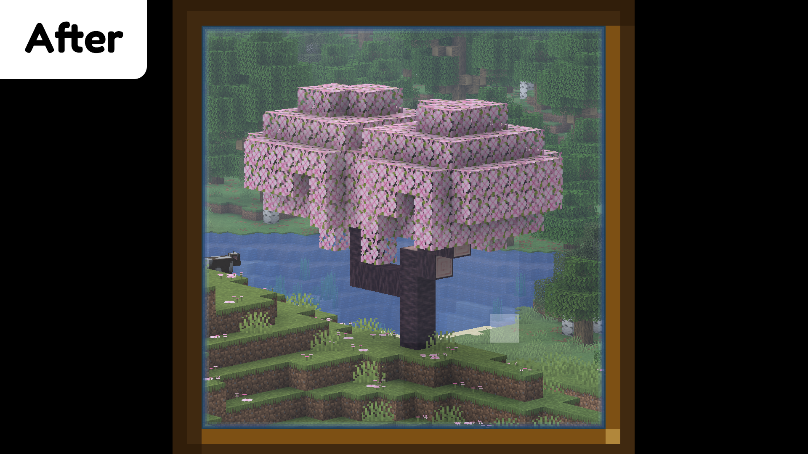

# Spyglass Only HUD

A client-side [Fabric](https://fabricmc.net/) mod for Minecraft that hides all HUD elements when looking through a spyglass, leaving only the spyglass overlay visible for a clean, immersive viewing experience.

## Preview

| Example | Before | After |
|:-:|:-:|:-:|
|  |  |  |

## Features

- **Full HUD suppression** while scoping — hides crosshair, hotbar, health/hunger/armor bars, mount health, status effects, and held item tooltip
- **Adjustable overlay scale** — resize the spyglass overlay via an in-game slider (default 90%)
- **Toggle on/off** — quickly enable or disable the mod without restarting
- **In-game settings screen** — press **K** (configurable) to open settings, or access via [Mod Menu](https://modrinth.com/mod/modmenu)
- **Config persistence** — settings are saved to a JSON file and survive restarts
- **Multilingual** — English, Russian, and Ukrainian translations included

## Installation

1. Install [Fabric Loader](https://fabricmc.net/use/installer/) for your Minecraft version
2. Install [Fabric API](https://modrinth.com/mod/fabric-api)
3. Drop the `spyglass-only-hud-*.jar` into your `.minecraft/mods/` folder
4. Launch the game and grab a spyglass!

## Usage

1. Equip and use a spyglass — the HUD will automatically hide
2. Press **K** to open the settings screen (rebindable in Controls)
3. Adjust the overlay scale or toggle the mod on/off

## Building from Source

```bash
git clone https://github.com/Reva1v/SpyGlassOnlyHUD.git
cd SpyGlassOnlyHUD
git checkout 26.1  # or any version branch
./gradlew build
```

The output JAR will be in `build/libs/`.

## License

[MIT](LICENSE)
